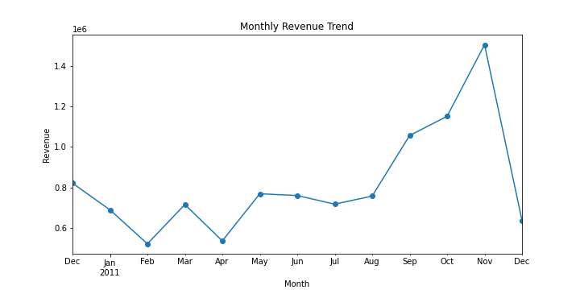
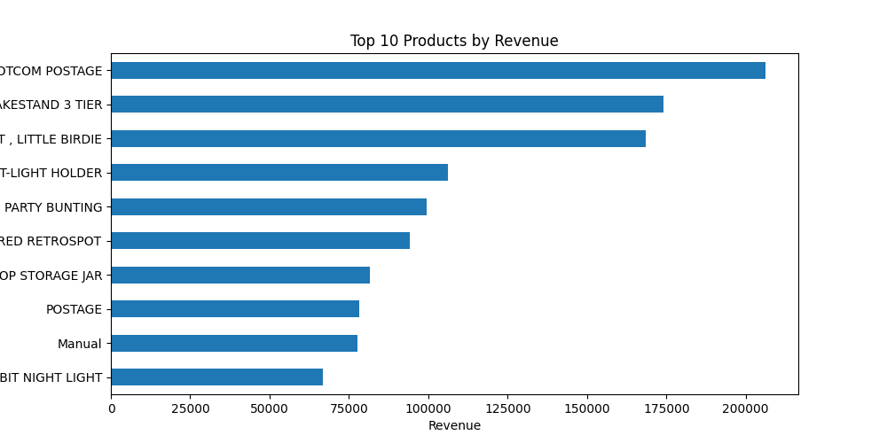
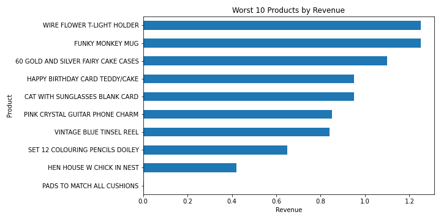
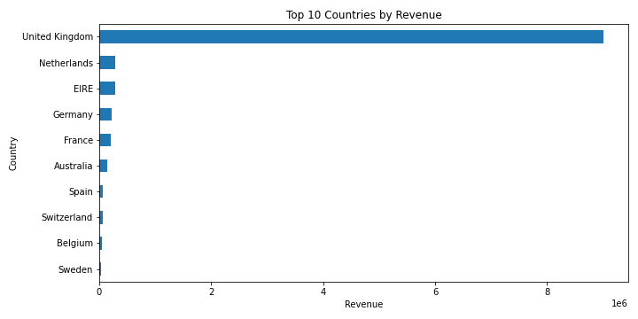
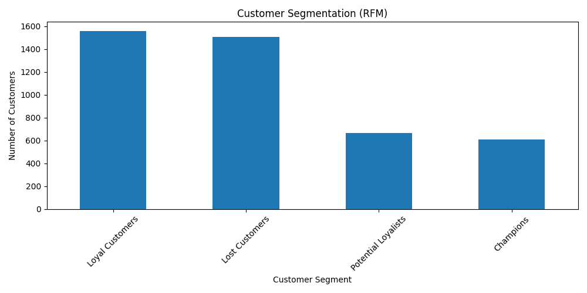

# Ecommerce Sales Analysis

## Project Overview

This project analyzes ecommerce transaction data to identify the key factors that drive sales performance. The goal is to transform raw transaction data into meaningful business insights that can help improve revenue and product strategy.

The analysis includes data cleaning, feature engineering, exploratory data analysis, and visualization of important sales trends.

---

## Business Question

**What factors drive sales performance and how can the company increase revenue?**

Key objectives:

* Identify top-performing and underperforming products
* Analyze monthly sales trends
* Evaluate geographic sales distribution
* Calculate key business performance metrics

---

## Tools Used

* Python
* Pandas
* Matplotlib
* Jupyter Notebook
* Git & GitHub

---

## Dataset

The dataset used in this project contains ecommerce transaction records from an online retail company.

Key columns include:

* **InvoiceNo** – unique transaction ID
* **StockCode** – product code
* **Description** – product name
* **Quantity** – number of items purchased
* **InvoiceDate** – date and time of the transaction
* **UnitPrice** – price per item
* **CustomerID** – unique customer identifier
* **Country** – customer location

Source: UCI Online Retail Dataset

---

## Analysis Steps

### 1. Data Cleaning

* Removed duplicate transactions
* Removed returned items (negative quantities)
* Removed invalid prices
* Handled missing values
* Converted date fields to datetime format

### 2. Feature Engineering

Created new features to support analysis:

* **Revenue column** = Quantity × UnitPrice
* **Month column** extracted from transaction date

### 3. Exploratory Data Analysis

Analyzed the dataset to uncover patterns including:

* Total revenue and sales metrics
* Monthly revenue trends
* Product performance
* Geographic revenue distribution

---

## Key Insights

* Revenue is concentrated among a relatively small number of products.
* Sales show seasonal patterns with stronger performance toward the end of the year.
* A small number of countries generate the majority of total revenue.
* Some products contribute very little revenue and may not justify inventory costs.

---

## Recommendations

Based on the analysis, the company could consider:

* Increasing promotion of top-performing products
* Creating bundles to increase average order value
* Reviewing low-performing products for pricing or discontinuation
* Targeting marketing efforts in high-revenue regions

---

## Visualizations

### Monthly Revenue Trend



### Top 10 Products by Revenue



### Worst Performing Products



### Revenue by Country



---

## Project Structure

```
business-sales-analysis
│
├── data
│   └── raw
│
├── images
│   ├── monthly_revenue.png
│   ├── top_products.png
│   ├── worst_products.png
│   └── country_sales.png
│
├── notebooks
│   └── business_sales_analysis.ipynb
│   └── customer_segmentation_rfm.ipynb
│
├── requirements.txt
└── README.md
```

## Additional Analysis: Customer Segmentation (RFM)

As an extension of the sales analysis, I performed RFM (Recency, Frequency, Monetary) customer segmentation to identify distinct customer groups based on purchasing behavior.

This analysis helped classify customers into segments such as:
- Champions
- Loyal Customers
- Potential Loyalists
- At Risk
- Lost Customers

### Customer Segmentation Visualization

